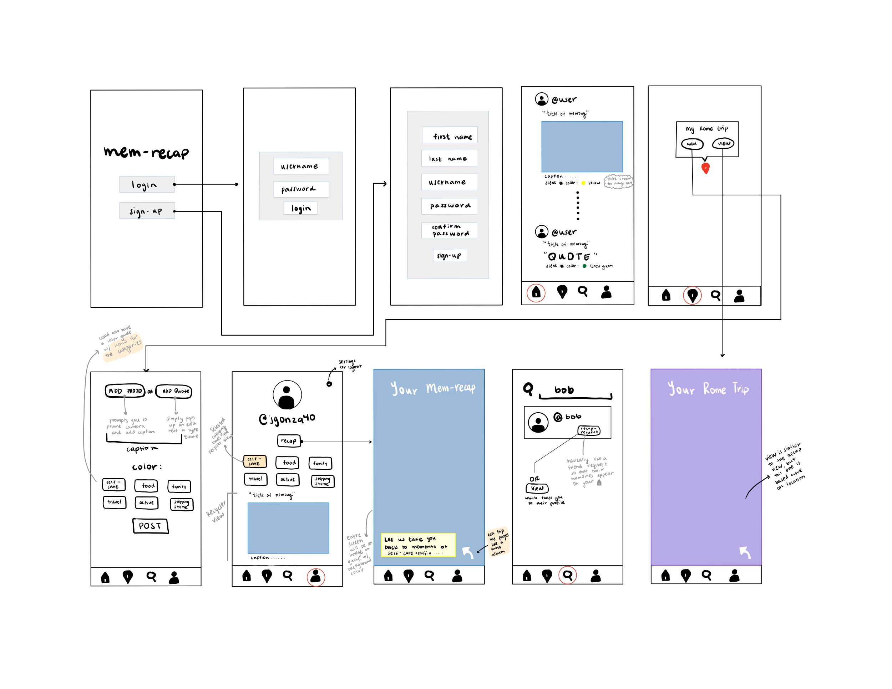
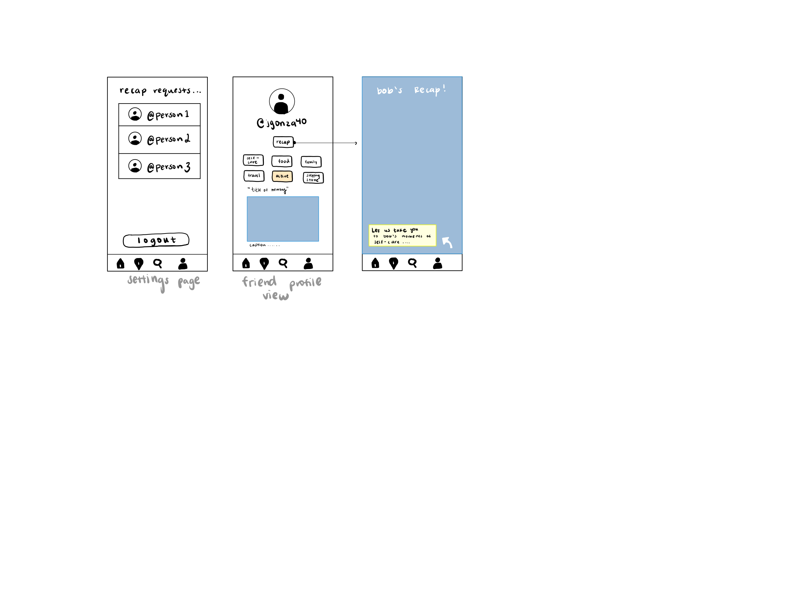

# FBUApplication

# mem-recap

## Table of Contents
1. [Overview](#Overview)
1. [Product Spec](#Product-Spec)
1. [Wireframes](#Wireframes)

## Overview
### Description
Social Media App with a focus on uploading memories in the form of images or quotes based on the location (city/country) they were created. Each pin on the map will be a place where the user created memories. This application then takes those memories and allows you to display a recap of your memories posted on the app thus far.

### App Evaluation
- **Category:** Social Networking
- **Mobile:** On the go! Most people are always carrying their phone; it will be easy for people to take a picture and upload it to add to their collection of memories.
- **Story:** Will allow friends to see the memories that their friends created throughout the year. It is a bit more intimate than other social media platforms (most users will probably only add their closest friends).
- **Market:** A way for individuals to keep in contact with close friends and family who they do not see frequently.
- **Habit:** Individuals create memories every day. They will feel driven to add more memories in hopes of having a better and fuller recap.
- **Scope:** There are a lot of small moving parts but I feel as though this app will be feasible. The trickiest part will be configuring the display of the recap (being able to flip through memories) and only displaying posts on the timeline of their friends.

## Product Spec
### 1. User Stories (Required and Optional)

**Required Must-have Stories**
* User logs in to access feed of the memories created by users they follow
* User can request to add more friends when searching
* Google Maps is implemented with the ability to drop pins
* Map pins are clickable and lead to the display of images/quotes when clicking "view" 
  * Ability to add images/quotes when clicking "add"
* Recap button in user profile leads to a recap of images/quotes in a categorized manner
* Can view friends' pages and recap
* Feed displays friends' posts in chronological order

**Optional Nice-to-have Stories**

* Displaying people user follows' memory pins on the Google Maps API.
* Displaying a recap video based on memories (probably the trickiest)
* Asking for user's birthday when signing up to later display zodiac sign in profile
* When zooming out of recap, can see all the categories displayed in the form of a journal

### 2. Screen Archetypes

* Login 
* Register - User signs up or logs into their account
   * Upon Download/Reopening of the application, the user is prompted to log in to gain access to their profile information to be able to begin posting. 
* Map Screen - Add pins to places they've gone
   * Can click on view (which goes to "slide show" of images/quotes they can flip through based on that trip/location)
   * Can click on add (ability to add to that specific trip/location)
* Profile Screen 
   * Lists memories under categories: self-care, food, family, active, stepping-stones (or career), travel
   * Includes the RECAP button which a goes to "slide show" of images/quotes they can flip through based on categories
   * Ability to add a profile picture
   * Includes settings button where you can log out and potentially accept friend requests
* Friend Profile Screen
   * Scroll through their memories (listed under categories) and view their recap
* Search Screen
   * Search friends by username to follow or view profile
* Settings Screen
   * Accept friend requests, logout button.
* Home Screen
   * See posts of friends in chronological order
   
### 3. Navigation

**Tab Navigation** (Bottom navigation bar)

* Home (view feed)
* Map (add content)
* Search (search by username)
* Profile (view recap or go to settings)

Optional:
* Music/Encounter Queue
* Discover (Top Choices)

**Flow Navigation** (Screen to Screen)
* Forced Log-in -> Account creation if no log in is available
* Home (view recent posts) -> view post details -> click on user to view profile?
* Profile -> Settings -> logout or accept friend requests
   * Profile -> Recap
* Map -> Add content or View trip content
* Search -> Add friends OR view friend profile -> Friend Recap

## Wireframes
 
 

